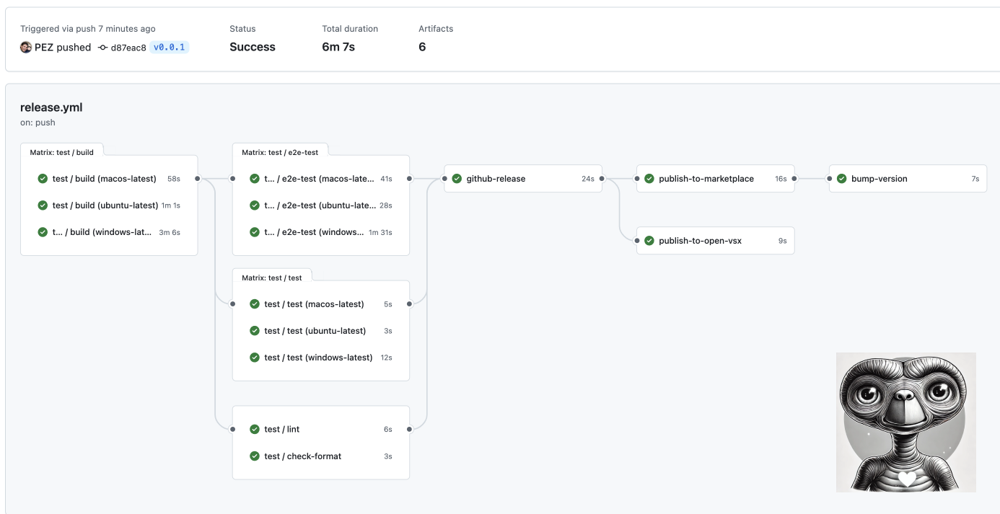
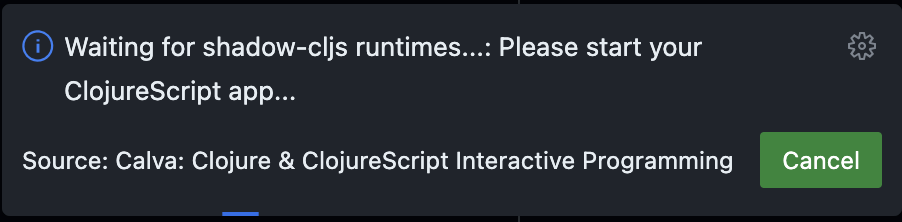
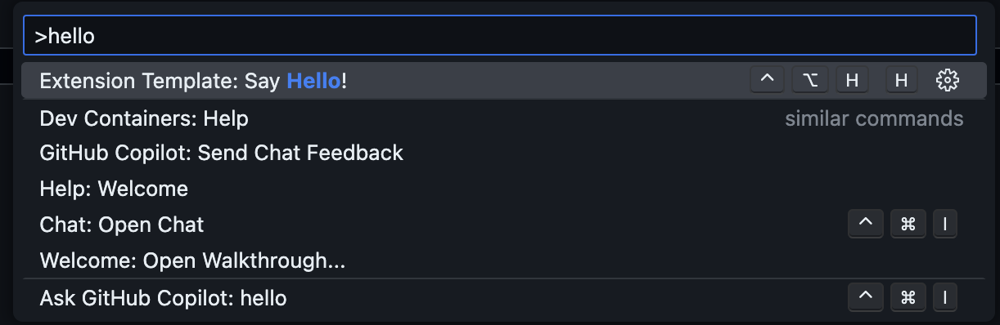

# VSC-ET

A VS Code Extension Template. Or an automated [VS Code](https://code.visualstudio.com) **extension development** workflow, with support for [coding](#coding), [building](#building), [testing](#testing), [end-to-end testing](#end-to-end-testing), and [publishing the extension](#publishing-the-extension) to the [VS Code Marketplace](https://marketplace.visualstudio.com/vscode) and the [Open VSX Registry](https://open-vsx.org/).


The workflow is powered by [Interactive Programming](https://en.wikipedia.org/wiki/Interactive_programming). You can use the extension while you are hacking on it, without reloading the extension host. The feedback is instantaneous. As it should be to keep coding productive and maximum fun.

## Who is this for?

It is probably for you. 😄 Especially if you would like to build an extension for VS Code. Also if:

- You want to explore what it takes to publish an extension to the VS Code Marketplace in an automated manner.
- Like to have the plumbing for testing, including end-to-end testing, in place from the get-go, ready for you to fill in as you build your extension
- You would like to learn Clojure/ClojureScript in a fun way
- Interactive Programming is your thing
- You think that Interactive Programming might be your thing

## What are the prerequisites?

The tools you need to get started are:

- [VS Code](https://code.visualstudio.com/)
  - The [Calva](https://calva.io) extension
  - The [Joyride](https://github.com/BetterThanTomorrow/joyride) extension
- [Node.js](https://nodejs.org/)
- [Java](https://jdk.java.net/23/)
- [Clojure CLI](https://clojure.org/guides/install_clojure)
- [Babashka](https://github.com/babashka/babashka#installation)
- **If you plan to publish your extension**: At least a skim through Microsofts [Publishing extensions](https://code.visualstudio.com/api/working-with-extensions/publishing-extension) guide and one skim through the corresponding [Publishing Extensions](https://github.com/EclipseFdn/open-vsx.org/wiki/Publishing-Extensions) guide for [open-vsx](https://open-vsx.org/).

Add your curiosity and you should be good to go. To just try the template/workflow out, you do not need to know any ClojureScript (or even programming). When you start to try make the extension do something interesting, you will need to know _some_ Clojure/ClojureScript. Learning Clojure will be a fun endeavor, I promise.

## How do I get started?

On Github **Use this template**, and name your repository, say you are full of imagination and name it **my-extension**. Clone your repo and open it in VS Code.
> **You may want to wait with renaming the extension itself** until you've confirmed that you can compile and start it, and connect the REPL for development. When that's confirmed, renaming the extension is mainly a matter of a global search and replace in the project. Something like so:
> 1. Make a global search (<kbd>cmd/ctrl</kbd>+<kbd>shift</kbd>+<kbd>f</kbd>) for `vsc-et`. Activate case sensitivity and whole-word matching for precision. Study the results, removing the ones you don't think apply (I think it's safe to replace all occurrences). Expand the replace input and study the results list some more before clicking the **Replace All** button.
> 1. Make a global search replace of “Extension Template”, similarly case sensitive and matching whole words.
> 1. The publisher of the extension template is `betterthantomorrow`, which you will need to change if you are to publish your extension to the marketplace. See above under prerequisites for the guides to go through to get your publisher id.

### Starting the extension

... and connecting the ClojureScript REPL.

The paved path is:

1. <kbd>cmd/ctrl+shift+b</kbd>. This starts the default build task, which is configured (in [.vscode/tasks.json](.vscode/tasks.json) to start Clojure with an nREPL server. This will happen in a terminal named **Build+watch extension**.
   * Wait for it to report something like:
     ```
     nREPL server started on port 56749 on host localhost - nrepl://localhost:56749
     ```
1. <kbd>ctrl+alt+c ctrl+alt+c</kbd>. This runs the command: **Calva: Connect to a Running REPL Server in the Project**
   * It will connect the Clojure REPL, start a ClojureScript (shadow-cljs) REPL, and build the extension.
   * This will compile the extension and run the tests. Wait for the **Build+watch extension** to show that the tests have ran, and for Calva to pop up a progress dialog looking something like so:
     
   * Hint: _The ClojureScript app is your extension_.
1. <kbd>F5</kbd>. This starts the VS Code _Development Extension Host_ (because configured to do so in [.vscode/launch.json](.vscode/launch.json))
   * The development extension host is a VS Code window where your extension under development is installed. You now need to activate it to actually start the ClojureScript app.
1. In the extension development host <kbd>cmd/ctrl+shift+p</kbd>, find and run the command **Extension template: Say hello!**
   
   * This activates your extension and starts the ClojureScript app and its REPL
1. Back in the development project you will see the progress dialog go away. Because now the development project window is connected to the Development Extension Host window's REPL.
      * Now you can hack on the extension code, which will update the app in the extension host window while it is running (a.k.a. interactive programming).

The important thing to note here is the steps where you activate your extension in the development host, starting the ClojureScript repl which Calva can connect to. Depending on the extension you build, it may be that it activates automatically, or by some specific file appearing or whatever. The point is that your extension needs to be activated for Calva to connect to it, and that starting the development host is often not enough to start your extension.


## Hacking on your extension

TBD...

### Publishing your extension

Thus possibly involves carrying out the steps at [create your own organization](https://learn.microsoft.com/azure/devops/organizations/accounts/create-organization)

TBD...

## Who built this?

My name is Peter Strömberg, a.k.a. [PEZ](https://github.com/PEZ). I love Clojure and VS Code, and I love to build things. I created Calva, an extension for working with Clojure in VS Code. I also co-created Joyride, a scripting environment for VS Code that lets you extend the editor in user space (i.e. without creating an extension). I've also created [Paste Replace](https://marketplace.visualstudio.com/items?itemName=betterthantomorrow.paste-replaced), and a whole bunch of Joyride scripts, big and small (mostly small).

I created this template because I want to share what I have figured out about building and maintaining extensions for VS Code. To me it is the most fun and rewarding way to spend my time, and I want you to have as much fun as I get. 😄 Calva is mostly built with TypeScript, and I'd like to contribute to you building your extensions in a more civilized programming language. Because ClojureScript is much, much, more fun than TypeScript.

That said, the workflow and automation used in the template are used for Calva, as well as with my pure ClojureScript extensions, so if you find the rest of the automation in this template useful, you can most definitely use it with a TypeScript tool chain.

## License

MIT

Free to use, modify and redistribute as you wish. 🍻🗽

## Sponsor my open source work ♥️

That, said, you are welcome to show me you like my work using this link:

* https://github.com/sponsors/PEZ
